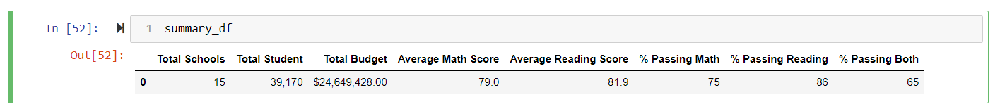
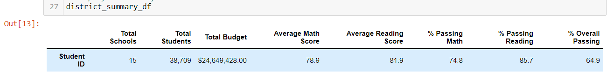
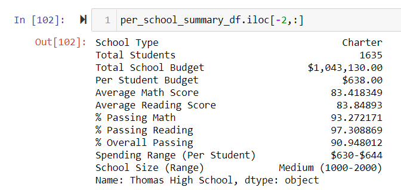
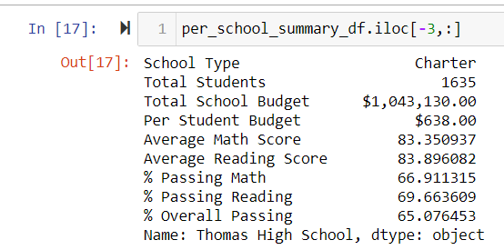
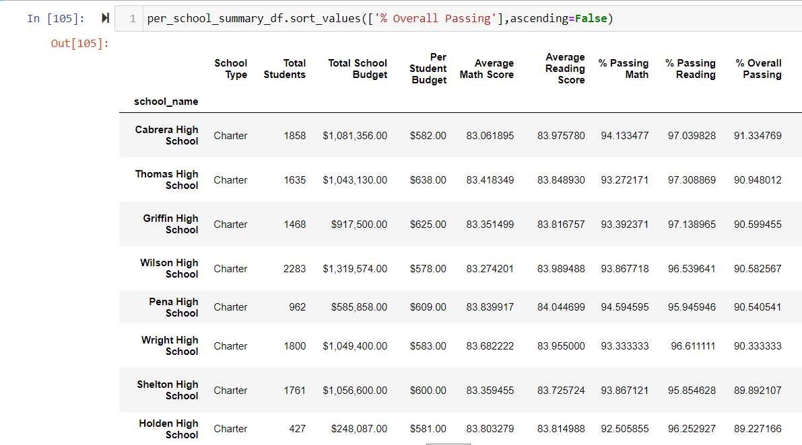
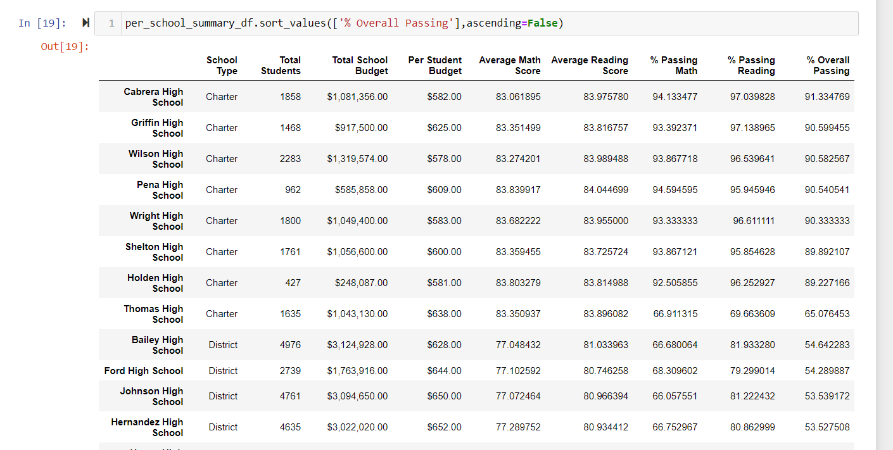
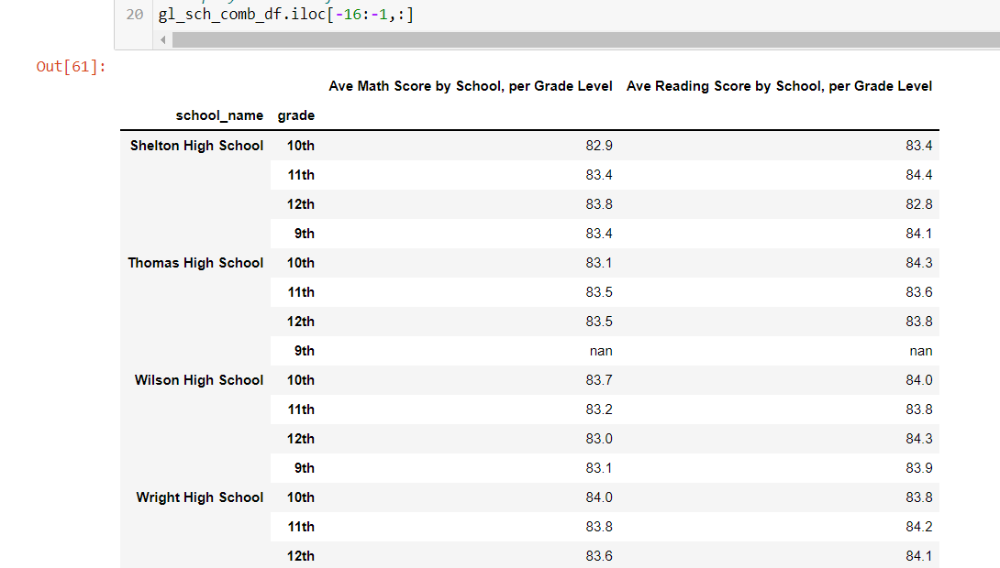
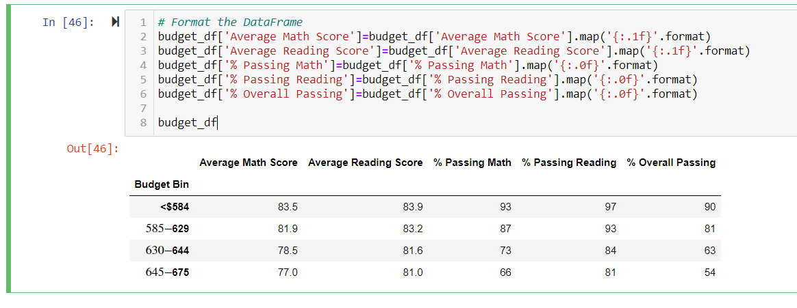

# School_District_Analysis

## Overview of the School District Analysis
The purpose of this analysis was to show the aggregate scores for Reading and Math for a given school district, based on characteristics of the schools.  There was also an effort to remove a certain set of scores (9th graders at Thomas High School), and then analyze the subsequent changes to the data.

## Results
Over the past week, during the learning of this Module in class, we found many aggregate scores for Reading and Math.  During the challenge today, we removed the scores of Thomas High 9th graders from the data.  We can use the old data from the Module as a baseline to see how the removal of Thomas High 9th graders' scores from the dataset has affected our numbers.

At a district level, the numbers were not affected very much.  We can observe a slight decrease in the Average Math Score (from 79.0 to 78.9).

79.0 -->

78.9 -->

The school summary is affected for Thomas High School, only.  We can see that, when we removed the 9th graders' data, the percentage of Thomas High students who were passing Math, the percentage passing Reading, and the percentage passing Both were greatly reduced.

Thomas High Data, % Passing {Math/Reading/Both} = {93% / 97% / 90%} -->

Thomas High Data, % Passing {Math/Reading/Both} = {66% / 69% / 65%} -->

Removing the Thomas High 9th graders' Math and Reading scores changes Thomas High's relative ranking from #2 to #8.

'#2 -->

'#8 -->

Removing the Thomas High 9th graders' Math and Reading scores affects many of the Metrics.  Regarding the Math and Reading scores by grade & school analysis, the only data point to be affected is the 9th graders from Thomas High School - you can see that there are "NaN" values in the table:

Regarding the scores by school spending, Thomas High spends $638 per student, so the third bin - "$630-$644" - is affected.

Regarding the scores by school size, Thomas High has 1635 students, so the second bin - "1500-1850" - is affected.

Regarding the scores by school type, Thomas High is a Charter school, so the Charter school bin is affected.

Generally speaking, the other 3 grades' worth of students at Thomas High School performed very closely to how the 9th graders performed.  Therefore, there are not huge swings in the figures when we only include the 10th, 11th, and 12th graders in the calculations.

The biggest change in numbers that we observed was, above, when we were analyzing the immediate affect of removing the Thomas High 9th graders scores.  That was because the denominator of the division calculation did include the 9th graders, still, at that time.  Further along in the analysis, that population was removed from consideration, and so the denominator for all division calculations changed, and so there was not that huge affect any longer.

There was quite a bit of analysis that was not affected at all by the Thomas High 9th graders.  When we look at school size, school spending per student, and school type, the data was only affected for the bins that Thomas High was included in.  All other bins were not affected at all.

There was one big surprise in this analysis.  A simple hypothesis about spending per student would be: the more the better.  However, the inverse was true.  The 4 bins that we created to show spending per student had an inverse relationship to their "% Overall Passing" figure.  The lowest bin - "<$584" - had 90% of students passing both Math and Reading.  From there, the average numbers went down as the spending per student increased.

